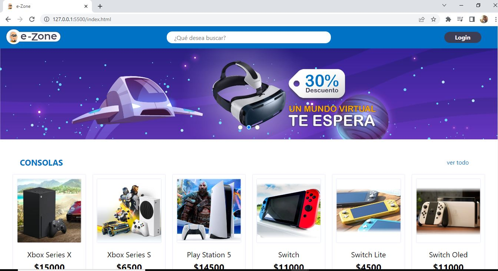

# Desafío e-commerce

## Oracle Next Education - Oracle + Alura Latam

  

## Link del sitio:

Pagina : [portafolio.github.io](https://spiderpaul.github.io/portafolio.github.io/)

## Descripción del proyecto

Este proyecto es un desafío perteneciente al proyecto Oracle Next Education, de Oracle y Alura Latam. Se ha realizado un e-commerce para practicar "fetch" y validaciones de formulario utilizando "expresiones regulares". El proyecto cuenta con un CRUD que trabaja con json-server. 

## Tecnologías utilizadas

Para la realización del portafolio, se utilizaron las siguientes tecnologías:

- **JavaScript**
- **HMTL**
- **CSS**

## Gracias:

Gracias por visitar mi repositorio.